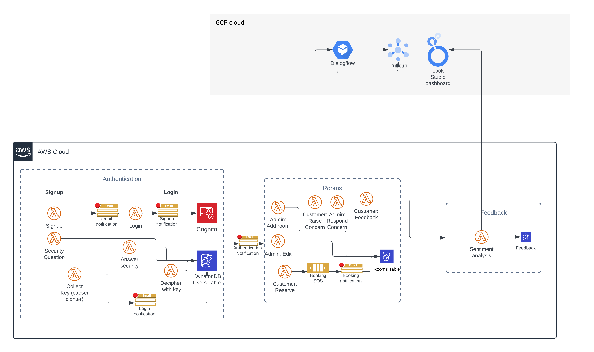

# DalVacationHome

<video width="320" height="240" controls>
  <source src="https://drive.google.com/file/d/1WUvHfPIUKP1LP5rvp_nrYTh8BsTcYaqx/view?usp=drive_link" type="video/mp4">
</video>

## Overview

DalVacationHome is an innovative serverless application designed for managing vacation rentals, guest interactions, and virtual support services. This cutting-edge platform employs a multi-cloud strategy and Backend-as-a-Service (BaaS) architecture, harnessing the power of both AWS and Google Cloud Platform (GCP) to ensure a scalable and resilient user experience.

The application caters to a diverse user base, including casual guests, registered customers, and property agents, each with role-specific access to various features. These functionalities encompass streamlined room booking processes, intuitive feedback mechanisms, and an intelligent virtual assistance system.

By leveraging the strengths of multiple cloud providers and adopting a serverless approach, DalVacationHome offers a modern, efficient solution for the vacation rental industry, capable of handling complex operations while maintaining flexibility and performance.

## Features

### For Guests

- **View Room Availability and Tariffs**: Guests can check the availability and pricing of different types of rooms and recreation facilities.
- **Access Virtual Assistant**: A chatbot built using Google Dialogflow helps guests navigate the site and provides basic information.
- **View Feedback and Ratings**: Guests can view feedback and overall ratings for specific rooms.

### For Registered Customers

- **Multi-Factor Authentication**: Registered customers must complete multi-factor authentication (using password, security questions, and a Caesar cipher challenge) to access their accounts.
- **Book Rooms**: Customers can book rooms and recreation facilities for specified periods.
- **Enhanced Virtual Assistant**: The chatbot provides additional functionalities such as booking management and direct communication with property agents.
- **Provide Feedback**: Customers can submit feedback on their stay and facilities.

### For Property Agents

- **Manage Rooms**: Agents can add or update room details, set prices, add discounts, and manage room features.
- **Respond to Customer Queries**: Agents can receive and respond to customer queries through an integrated messaging system.
- **View Analytics**: Agents have access to data analytics and user statistics through embedded dashboards.

## Architecture



The project is built using a combination of AWS and Google Cloud services to achieve a serverless, scalable architecture:

- **User Management and Authentication**: Utilizes AWS Cognito for user authentication and AWS Lambda functions in Node.js for multi-factor authentication, with data stored in DynamoDB.
- **Virtual Assistant Module**: Built using Google Dialogflow for natural language processing, integrated with AWS Lambda functions (Node.js) to handle backend logic.
- **Messaging System**: Implements Google Cloud Pub/Sub for asynchronous messaging between customers and property agents, with message logs stored in Firestore.
- **Notifications**: AWS SNS and SQS are used to send notifications for various user actions like successful registration, login, and booking confirmations.
- **Data Storage and Analysis**: Uses AWS DynamoDB and Google Cloud Storage for storing user and booking data. Google Looker Studio is used for data visualization and analytics.

## Technology Stack

- **Frontend**: React, with Google Dialogflow chatbot.
- **Backend**: AWS Lambda (Node.js), Google Cloud Functions.
- **Authentication**: AWS Cognito.
- **Database**: AWS DynamoDB, Google Firestore.
- **Messaging and Notification**: Google Cloud Pub/Sub, AWS SNS, and SQS.
- **Data Analysis and Visualization**: Google Looker Studio.
- **Hosting**: GCP Cloud Run for hosting the frontend application.

## Setup and Deployment

### Prerequisites

1. **AWS Account**: Required for setting up Cognito, Lambda functions, DynamoDB, SNS, and SQS.
2. **Google Cloud Platform Account**: Needed for Dialogflow, Cloud Functions, Firestore, and Cloud Run.

## Usage

- **Guests**: Navigate the site to view room availability and use the chatbot for basic information.
- **Registered Customers**: Log in using multi-factor authentication to book rooms, manage bookings, and communicate with property agents.
- **Property Agents**: Log in to manage room details, respond to customer queries, and access analytics.


### Setup infrastructure

- Follow documentation in [infra](./infra/README.md)
- Once everything is setup, you can run below command to deploy and destroy your AWS infrastructure.

```sh
make deploy
```

```sh
make destroy
```

### Lambdas

- Write your lambda functions inside dedicated folder `<your-lambda-name>`. Add `index.<any-programming-language>` file inside that folder that contains the logic.
- Write Deployment CDKTF definition for that lambda. Here is [example](https://git.cs.dal.ca/sarvaiya/serverless-project/-/commit/d2b83d63eda5fd6824df6b41b9f95cea88ada46f)

### UI

- UI code is written in `ui` folder using React.
- It is deployed to S3 as static website. You can either run it in your local or deploy (read `infra/README.md`).
